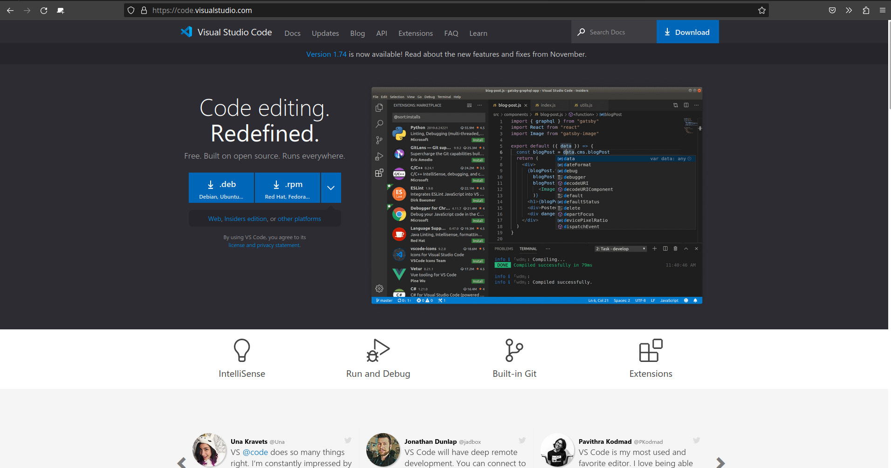
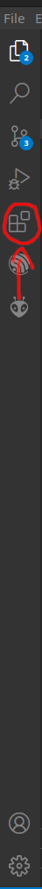
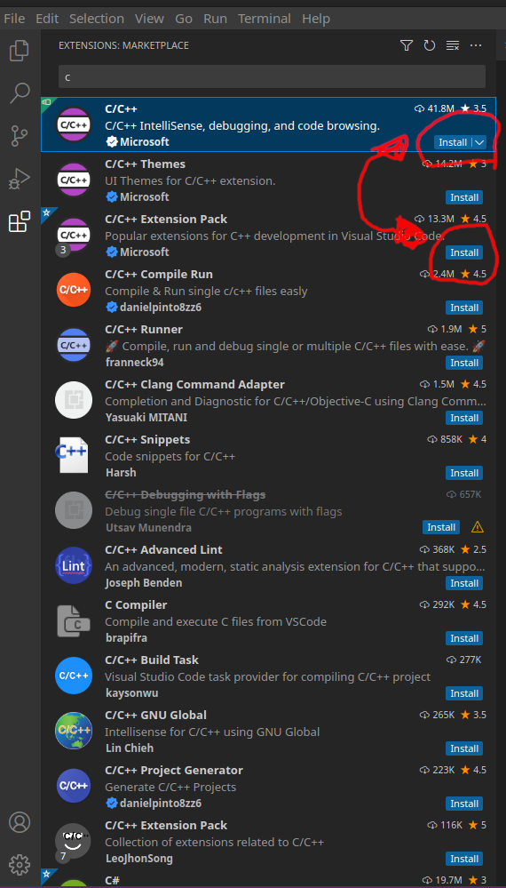
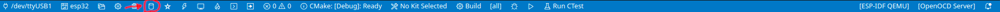

# Installeer VSCode met esp-idf

Stap 1-3 leggen uit waar en hoe VSCode te installeren mocht het nog niet op de computer staan.

### Stap 1: Download VSCode

Voor Windows en de Redhat familie is VSCode [hier](https://code.visualstudio.com/) te downloaden..



Onder Ubuntu kan er gebruik gemaakt worden van snap:

```
sudo snap install code
```

Onder Arch en Manjaro linux kan er gebruik gemaakt worden van snap:

```
# Install snap if not installed already
sudo pacman -S snap
# Enable and start snap service
sudo systemctl start snapd && sudo systemctl enable snapd
# Install vscode using snap
sudo snap install code
```

Indien geinstalleerd met snap is stap 2 niet nodig. Snap download en installeert de pakketten automatisch.

### Stap 2: Installeer VSCode (Windows en Redhat Linux)

Onder windows installeer het .exe bestand. Kies zelf de opties, standaard opties zijn ook prima.

### Stap 3: Start VSCode en configureer naar eigen voorkeur

Als je nu na de installatie VSCode voor het eerst opstart krijg je een configuratiescherm. Kies zelf de opties. Standaardopties zijn ook goed.

---

## Installeer c/c++ en c/c++ toolbox

### Stap 4: Open de extensions tab

Dit kun je doen door op de extensions knop in de sidebar te klikken:

of door op ctrl+shift+p te klikken en dan de optie "Extensions: Install Extensions" op te zoeken.



### Stap 5: Install c/c++ toolbox

Tik in de zoekbalk 'Search extensions' de zoekkreet c/c++ in. De volgende twee opties verschijnen en moeten geinstalleerd worden:



---

### Stap 6: Installeer esp-idf framework

Volg de [installatie gids](https://github.com/espressif/vscode-esp-idf-extension/blob/master/docs/tutorial/install.md) van espressif zelf voor de installatie van het esp-idf framework.

### Stap 7: Clone de git repo in Github Desktop

[Download](https://desktop.github.com/) en installeer het eerst...

Open GitHub desktop: login en selecteer de repo of tik in 'teunrensing/APPS'.

### Stap 8: Open de folder met VSCode.

De standaardbestandslocatie voor GitHub desktop is Documenten/GitHub. In deze folder staat de folder APPS.

Open de folder APPS_MAIN voor de firmware.

Klik op trust (als het gevraagd wordt)

### Stap 9: Run build

Klik op het bus icoontje onderin op de blauwe toolbar.


